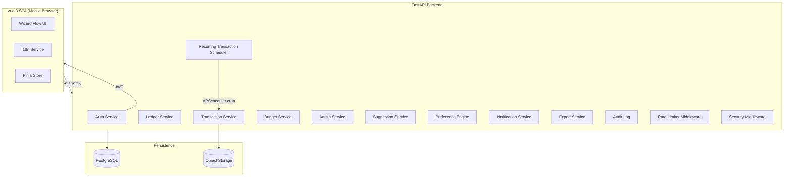
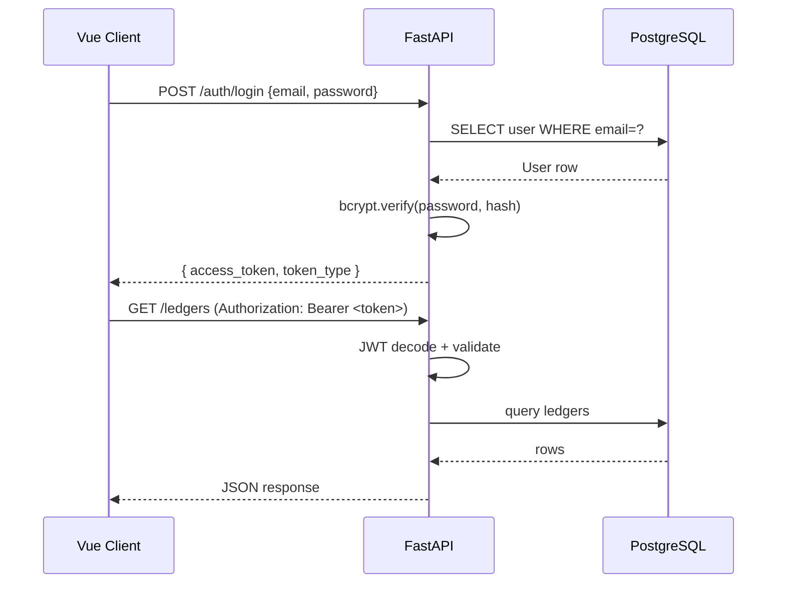
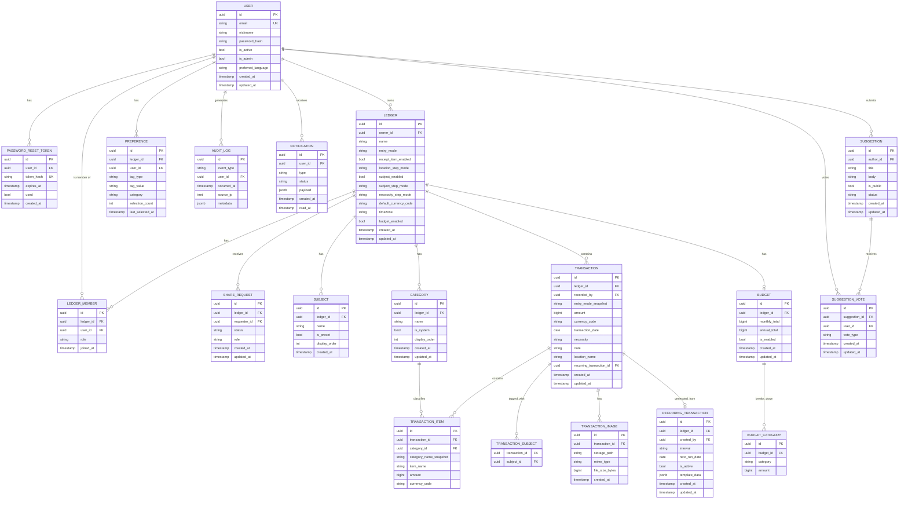

# Design Document — Mobile Bookkeeping App

## Overview

本系统是一款面向手机端的快速记账网页应用，采用前后端分离架构：

- **后端**：FastAPI（Python），提供 RESTful API，负责业务逻辑、认证、数据持久化
- **前端**：Vue 3（SPA），针对移动端单手操作优化，实现分屏向导式 UI
- **数据库**：PostgreSQL，通过 SQLAlchemy ORM 访问，Alembic 管理 Schema 迁移
- **存储**：服务端对象存储（如本地文件系统挂载或 S3 兼容服务）预留给未来小票图片；首个可用版本不要求前端图片附件入口

核心目标：以最少的点击次数完成一笔记账，支持多账本、账本共享、预算追踪、智能排序、一账本一货币、多语言。

---

## Architecture

### 整体架构图



### 请求认证流



### 分层设计

| 层次 | 职责 |
|------|------|
| Router（FastAPI routes） | 请求解析、输入验证（Pydantic）、调用 Service |
| Service | 业务逻辑、跨模型协调 |
| Repository（可选薄层） | SQLAlchemy Session 操作封装 |
| Model（SQLAlchemy ORM） | 数据库 Schema 映射 |
| Schema（Pydantic） | 请求/响应序列化与验证 |

---

## Components and Interfaces

### 后端模块

#### Auth Service
- `POST /auth/register` — 注册（邮箱 + 密码）
- `POST /auth/login` — 登录，返回 JWT（7天有效）
- `POST /auth/password-reset/request` — 发起密码重置
- `POST /auth/password-reset/confirm` — 确认密码重置
- `PATCH /auth/me/profile` — 更新当前用户昵称、语言等个人偏好
- `POST /auth/me/change-password` — 当前用户输入旧密码后修改密码，并使旧 JWT 失效
- `DELETE /auth/account` — 账号注销（需输入当前密码）

限流（由 Rate Limiter 中间件实施）：
- 登录：10次失败/IP/15分钟
- 密码重置请求：5次/邮箱/小时
- 注册：10次/IP/小时

#### Ledger Service
- `POST /ledgers` — 创建账本
- `GET /ledgers` — 列出当前用户账本
- `GET /ledgers/{id}` — 账本详情
- `PATCH /ledgers/{id}` — 更新账本配置（名称、Subject_Step_Mode、Necessity_Step_Mode）
- `DELETE /ledgers/{id}` — 删除账本（级联删除所有交易）
- `GET /ledgers/{id}/categories` — 获取系统固定分类
- `POST /ledgers/{id}/categories` — Legacy/Internal：添加自定义分类（当前产品不暴露入口）
- `PATCH /ledgers/{id}/categories/{category_id}` — Legacy/Internal：重命名自定义分类（当前产品不暴露入口）
- `DELETE /ledgers/{id}/categories/{category_id}` — Legacy/Internal：删除自定义分类（当前产品不暴露入口，系统默认分类不可删）
- `GET /ledgers/{id}/share-code` — 获取分享码
- `POST /ledgers/{id}/share-requests` — 提交加入申请
- `GET /ledgers/{id}/share-requests` — Owner 查看待审申请
- `POST /ledgers/{id}/share-requests/{req_id}/approve` — 批准
- `POST /ledgers/{id}/share-requests/{req_id}/reject` — 拒绝
- `GET /ledgers/{id}/members` — 查看共享成员列表
- `PATCH /ledgers/{id}/members/{user_id}` — 修改共享成员权限（read-only / read-write）
- `DELETE /ledgers/{id}/members/{user_id}` — 移除共享成员

共享通知采用两层机制：MVP 必须通过顶部通知铃铛、通知列表、待审申请列表和申请状态字段在应用内可见；若 SMTP 已配置，则同步发送邮件通知 Owner 或申请人。后续可在此基础上扩展 Web Push。

#### Notification Service
- `GET /notifications` — 当前用户查看通知列表
- `GET /notifications/unread-count` — 当前用户未读通知数，用于顶部铃铛红点
- `POST /notifications/{id}/read` — 标记单条通知为已读
- `POST /notifications/read-all` — 标记全部通知为已读

通知来源：
- 共享申请创建：通知账本 Owner
- 共享申请批准/拒绝：通知申请人
- 共享成员权限变更或移除：通知被影响成员
- 预算告警、系统公告等可复用同一 Notification 表扩展

#### Transaction Service
- `POST /ledgers/{id}/transactions` — 创建交易
- `GET /ledgers/{id}/transactions` — 交易列表（分页，按日期倒序）
- `GET /ledgers/{id}/transactions/{txn_id}` — 交易详情
- `PATCH /ledgers/{id}/transactions/{txn_id}` — 更新交易
- `DELETE /ledgers/{id}/transactions/{txn_id}` — 删除交易（级联删除图片）
- `GET /ledgers/{id}/summary` — 统计汇总（分类/花费对象/必要性）
- `GET /ledgers/{id}/export` — CSV 导出

#### Budget Service
- `POST /ledgers/{id}/budget` — 创建/更新预算配置
- `GET /ledgers/{id}/budget` — 查询预算配置与进度
- `DELETE /ledgers/{id}/budget` — 禁用预算

#### Preference Engine
- `GET /ledgers/{id}/preferences/subjects` — 排序后的花费对象列表
- `GET /ledgers/{id}/preferences/categories` — 排序后的分类列表
- `GET /ledgers/{id}/preferences/items?category={cat}` — 排序后的商品名建议
- `GET /ledgers/{id}/preferences/locations` — 当前用户按使用频次排序的消费地点

偏好更新在交易保存时由 Transaction Service 内部调用，对外不暴露写接口。

#### Export Service
- MVP 提供 CSV 导出，接口为 `GET /ledgers/{id}/export`
- 导出层应基于 Transaction 查询结果和 formatter 分离设计，预留 OFX formatter 扩展点；当前不实现 OFX

#### Recurring Transaction Service
- `POST /ledgers/{id}/recurring` — 创建定期交易模板
- `GET /ledgers/{id}/recurring` — 列出模板
- `PATCH /ledgers/{id}/recurring/{id}` — 更新模板
- `DELETE /ledgers/{id}/recurring/{id}` — 删除模板

后台调度：APScheduler（AsyncIOScheduler），每天 00:00 UTC 检查并生成到期的定期交易。

#### Admin Service
- `GET /admin/users` — 列出所有用户
- `PATCH /admin/users/{id}/status` — 启用/禁用账号
- `DELETE /admin/users/{id}` — 删除用户及其所有数据
- `GET /admin/stats` — 系统统计（用户数、账本数、交易数）
- `GET /admin/suggestions` — 管理员查看所有用户建议（含私有建议）
- `PATCH /admin/suggestions/{id}/status` — 更新建议处理状态

所有 Admin 端点通过 `require_admin_role` 依赖项守卫。

#### Suggestion Service
- `POST /suggestions` — 当前用户提交建议（title、body、is_public）
- `GET /suggestions/mine` — 当前用户查看自己的建议列表
- `GET /suggestions/public` — 查看公开建议列表（支持/反对计数）
- `POST /suggestions/{id}/vote` — 对公开建议支持或反对；同一用户重复投票时更新立场

权限约束：
- 私有建议仅作者本人和 Admin 可见
- 公开建议对所有已认证用户可见
- 建议作者不可对自己的建议投票
- 每个用户对同一建议最多保留一条当前投票记录

#### Image Attachment（Future / Deferred）
- `POST /transactions/{txn_id}/images` — 上传图片（multipart/form-data，最多 3 张，每张 ≤ 5MB，JPEG/PNG）
- `DELETE /transactions/{txn_id}/images/{img_id}` — 删除图片

图片附件后端接口可作为预留能力存在；首个可用版本不要求前端在 Wizard 或交易详情中暴露上传、缩略图、删除图片入口。

### 前端模块（Vue 3）

| 模块 | 职责 |
|------|------|
| `WizardFlow.vue` | 分屏向导容器，管理步骤状态机 |
| `WizardStep*.vue` | 各步骤组件：Amount / Category / Item / Necessity / Subject |
| `LedgerList.vue` | 账本列表页 |
| `LedgerDetail.vue` | 账本详情（交易列表 + 预算进度） |
| `BudgetWizard.vue` | 预算设置向导 |
| `SummaryView.vue` | 统计汇总页 |
| `Settings.vue` | 账本设置、共享码、待审批申请、成员列表入口 |
| `ShareJoinView.vue` | 输入分享码或打开分享链接，提交加入申请 |
| `ShareMemberView.vue` | 共享成员详情，修改权限或停止共享 |
| `ProfileView.vue` | 个人信息、昵称编辑、密码修改、账号注销入口 |
| `NotificationBell.vue` | 顶部通知铃铛与未读红点 |
| `NotificationsView.vue` | 通知列表、标记已读 |
| `SuggestionsView.vue` | 用户提交建议、查看自己的建议、浏览公开建议并支持/反对 |
| `AuthPages.vue` | 注册 / 登录 / 密码重置 |
| `AdminPanel.vue` | 管理员后台；包含用户管理、系统统计与建议管理入口 |
| `i18n.ts` | vue-i18n 集成，支持 zh-CN / en / ja |
| `api.ts` | axios 封装，统一注入 Authorization header |
| `store/` | Pinia stores（auth、ledger、transaction、preference） |

Wizard Flow 前端交互约束：
- `WizardStepAmount.vue` 使用应用内自制数字键盘作为金额主输入方式，不渲染原生金额输入框，不依赖浏览器/系统输入法；上方以计算器式显示区展示当前金额和默认货币，OK 键确认后进入下一步。
- `WizardStepCategory.vue` 默认展示偏好排序后的分类标签。receipt（一张小票一笔）模式选择 Category 后，根据 `receipt_item_enabled` 决定进入可跳过的消费名称步骤或继续下一步。
- `WizardStepItem.vue` 在 item（逐商品）模式中必填，在启用消费细节的 receipt 模式中可跳过；两种模式均加载同一套分类预置/偏好消费名称，自定义消费名称通过 `+ 自定义` 标签入口打开文本输入框。可跳过时，带警示 icon 的跳过按钮置于标签列表上方。
- `WizardStepLocation.vue` 位于消费名称之后、必要性之前，显示历史常用地点与 `+ 追加`；追加地点后先回到完整标签列表，不自动选择或前进，用户明确点击新标签后才进入下一步。`location_step_mode=optional` 时在列表上方显示带警示 icon 的跳过按钮，`required` 时必须选择。
- `WizardFlow.vue` 统一渲染顶部标题栏：Amount 标题为"输入金额"，Amount 左侧返回回到账本主页，后续步骤左侧返回到上一步；完成页标题为"记录成功"且不提供返回动作。
- `WizardFlow.vue` 在步骤切换和进入完成页时应将当前 Wizard/页面滚动位置重置到顶部，避免上一屏滚动位置影响下一屏。
- `WizardStepNecessity.vue` 不做默认预选或超时自动保存；"刚需"、"非刚需"、"关闭此步骤"均使用同等级的大块按钮。
- `LedgerDetail.vue`、Wizard 各步骤及消费记录列表静态文案均必须通过 `vue-i18n` 消息键渲染，测试需防止 `transaction.list`、`transaction.monthTotal` 等裸 key 暴露到 UI。
- `LedgerDetail.vue` 以月份为单位查询并展示消费记录，本月合计来自当前月日期范围；月份切换位于账本标题和操作按钮下方，中间显示完整年月，不显示页码或“消费记录 · 年月”外层卡片标题。
- 已登录全局顶部菜单提供语言切换入口，复用 `AuthStore.updatePreferredLanguage()` 同步本地偏好与后端用户偏好。
- 已登录全局顶部栏在汉堡菜单左侧显示通知铃铛；未读通知数大于 0 时显示红点，点击进入通知列表。
- 账本设置页的分享码区域使用只读 code/input 加 copy icon 按钮；复制成功/失败提示使用顶栏下方居中的浮动 toast。
- 共享成员、共享申请、通知和 Admin 用户列表中的用户显示名统一走 `display_name = nickname || email`。
- 新建账本向导使用动态步骤：名称 → 记录模式 → 小票消费细节（仅 receipt）→ 花费对象 → 必要性 → 消费地点 → 默认货币。各记录选项独占一屏并使用大块标签按钮；时区保留后端默认值，不在货币步骤显示。

---

## Data Models

### Entity Relationship Diagram



### 关键数据模型说明

**金额精度**：所有金额字段使用 `BIGINT` 存储货币最小单位（日元存 ¥，人民币存分，美元存 cents），避免浮点精度问题。

**USER.nickname**：可为空，最大长度建议 50。所有面向其他用户的显示位置使用 `display_name = nickname || email`，包括共享申请、共享成员、通知、Admin 用户列表和建议作者信息。

**entry_mode**：账本级枚举，`receipt`（一张小票）或 `item`（逐商品）。

**receipt_item_enabled**：仅影响 `receipt` 模式；开启后显示可跳过的消费名称步骤。

**location_step_mode**：`required` | `optional` | `disabled`，默认 `optional`。

**subject_step_mode**：`required` | `optional` | `disabled`

**necessity_step_mode**：`enabled` | `disabled`

**PREFERENCE 表**：`tag_type` = `subject` | `category` | `item` | `location`；`category` 字段在 `tag_type=item` 时非空。Location 不使用预设多语言键，按当前用户历史输入与频次排序。

**CATEGORY 表**：每个账本包含系统固定分类；`is_system=True` 的默认分类不可删除，`display_order` 用于默认排序和偏好排序 tie-breaker。当前产品不在 UI 中暴露自定义分类入口。

系统默认分类当前为：`category.food`（食品饮料）、`category.dining`（外食餐饮）、`category.daily`（日用品）、`category.clothing`（服饰鞋包）、`category.housing`（居住）、`category.utilities`（水电燃气）、`category.communication`（通信网络）、`category.transport`（交通出行）、`category.vehicle`（汽车用车）、`category.medical`（医疗健康）、`category.insurance`（保险）、`category.education`（教育学习）、`category.childcare`（育儿子女）、`category.pets`（宠物）、`category.entertainment`（娱乐休闲）、`category.travel`（旅行住宿）、`category.digital`（数码家电）、`category.subscriptions`（订阅会员）、`category.social`（社交礼金）、`category.beauty`（美容护理）、`category.taxes`（税费手续费）、`category.other`（其他）。Category 是预算和统计维度的消费大类；具体费用如油费、停车费、车检、保养等应作为 `category.vehicle` 下的 Item name，而不是默认直接新增为 Category。

**TRANSACTION_ITEM.category_name_snapshot**：保存记账当时的分类名称快照，确保后续自定义分类重命名或删除不改变历史交易显示。

**NOTIFICATION 表**：MVP 用于记录共享申请、审批结果、共享成员权限变更/移除等站内可见状态；邮件发送是辅助通道，不能作为唯一状态来源。`read_at IS NULL` 表示未读，顶部铃铛红点基于未读数量。

**SUGGESTION 表**：保存用户建议；`status` = `new` | `reviewing` | `planned` | `completed` | `declined`；`is_public=False` 时仅作者和 Admin 可见。

**SUGGESTION_VOTE 表**：保存公开建议投票；`vote_type` = `support` | `oppose`；`(suggestion_id, user_id)` 建唯一约束，确保一个用户对同一建议只有一个当前立场。

**AUDIT_LOG**：仅追加，数据库层通过 Trigger 或应用层限制禁止 UPDATE/DELETE。

**RECURRING_TRANSACTION.template_data**：JSONB，存储与 Transaction 相同结构的模板快照，便于生成新交易时复制。

### SQLAlchemy 模型（示意）

```python
class Transaction(Base):
    __tablename__ = "transactions"
    id: Mapped[uuid.UUID] = mapped_column(primary_key=True, default=uuid.uuid4)
    ledger_id: Mapped[uuid.UUID] = mapped_column(ForeignKey("ledgers.id"), nullable=False)
    recorded_by: Mapped[uuid.UUID] = mapped_column(ForeignKey("users.id"), nullable=False)
    amount: Mapped[int] = mapped_column(BigInteger, nullable=False)  # smallest currency unit
    currency_code: Mapped[str] = mapped_column(String(3), nullable=False)
    transaction_date: Mapped[date] = mapped_column(Date, nullable=False)
    necessity: Mapped[str] = mapped_column(String(20), default="essential")
    note: Mapped[Optional[str]] = mapped_column(String(500))
    created_at: Mapped[datetime] = mapped_column(server_default=func.now())
    updated_at: Mapped[datetime] = mapped_column(onupdate=func.now())
    items: Mapped[List["TransactionItem"]] = relationship(cascade="all, delete-orphan")
    images: Mapped[List["TransactionImage"]] = relationship(cascade="all, delete-orphan")
```

### Alembic 迁移策略

- 每次 Schema 变更生成一个独立迁移文件，包含 `upgrade()` 和 `downgrade()`
- 应用启动时执行 `alembic upgrade head`（在 FastAPI lifespan 事件中）
- 迁移脚本不含硬编码值，通过 `os.environ` 读取配置
- `alembic_version` 表由 Alembic 自动维护

---


## Correctness Properties

*A property is a characteristic or behavior that should hold true across all valid executions of a system — essentially, a formal statement about what the system should do. Properties serve as the bridge between human-readable specifications and machine-verifiable correctness guarantees.*

---

### Property 1: 注册邮箱唯一性

*For any* two registration requests using the same email address, the second request SHALL be rejected with an error indicating the email is already in use, regardless of the password provided.

**Validates: Requirements 1.1, 1.2**

---

### Property 2: JWT 令牌有效期

*For any* successful login, the returned JWT's `exp` claim SHALL be set to exactly 7 days from the time of issuance (within a 60-second tolerance).

**Validates: Requirements 1.3**

---

### Property 3: 登录认证错误不泄露字段信息

*For any* login attempt with a wrong email and *for any* login attempt with the correct email but wrong password, the API response body and status code SHALL be identical.

**Validates: Requirements 1.4**

---

### Property 4: 密码重置令牌单次有效

*For any* valid password reset token, after it has been used once to reset a password, submitting the same token again SHALL return an error indicating the token is invalid or expired; the token SHALL NOT be accepted a second time.

**Validates: Requirements 1b.5, 1b.6**

---

### Property 5: 密码重置后旧 JWT 失效

*For any* user who completes a password reset, all JWT tokens that were issued before the reset SHALL be rejected by the API with a 401 Unauthorized response.

**Validates: Requirements 1b.7**

---

### Property 6: 账本名称长度约束

*For any* string of length 0 or greater than 50 characters submitted as a ledger name, the Ledger_Service SHALL reject the request with a 422 Unprocessable Entity error; *for any* string of length 1–50 characters, the request SHALL be accepted.

**Validates: Requirements 2.1**

---

### Property 7: 账本数量上限

*For any* user who already owns 10 ledgers, any attempt to create an additional ledger SHALL be rejected with an error indicating the maximum limit has been reached.

**Validates: Requirements 2.7**

---

### Property 8: 花费对象（Subject）数量上限

*For any* ledger where the combined count of preset and custom subjects equals 20, any attempt to add an additional custom subject SHALL be rejected.

**Validates: Requirements 3.2**

---

### Property 9: 预设 Subject 不可删除

*For any* preset subject in any ledger, a deletion request targeting that subject SHALL be rejected; only custom subjects SHALL be deletable.

**Validates: Requirements 3.3**

---

### Property 10: 偏好引擎计数与排序

*For any* ledger, user, and tag (subject, category, or item), after N selections of that tag, its selection count SHALL equal N; *and* when the tag list is returned, it SHALL be ordered by selection count descending, with ties broken by the original default order.

**Validates: Requirements 3.4, 3.5, 4.8, 4.9, 10.1, 10.2, 10.3**

---

### Property 11: 禁用必要性步骤后自动记录为"刚需"

*For any* transaction recorded in a ledger where `necessity_step_mode` is `"disabled"`, the `necessity` field of the persisted transaction SHALL equal `"essential"` without requiring user input.

**Validates: Requirements 5.13**

---

### Property 12: 非数字金额被拒绝

*For any* request to create a transaction where the amount field contains a non-numeric or non-integer value, the Transaction_Service SHALL return a 422 Unprocessable Entity error.

**Validates: Requirements 8.3**

---

### Property 13: 只读共享用户无法创建交易

*For any* user with `read-only` share role in a ledger, any attempt to create, update, or delete a transaction in that ledger SHALL be rejected with a 403 Forbidden response.

**Validates: Requirements 9.3**

---

### Property 14: 账本共享人数上限

*For any* ledger that already has 10 shared members (excluding the owner), any attempt to approve an additional share request SHALL be rejected.

**Validates: Requirements 9.7**

---

### Property 15: 交易列表按日期倒序排列

*For any* ledger with N transactions, the transaction list endpoint SHALL return transactions ordered strictly by `transaction_date` descending; no two adjacent items in the response SHALL violate this ordering.

**Validates: Requirements 12.1**

---

### Property 16: 分页每页不超过 50 条

*For any* ledger with more than 50 transactions, a single page of the transaction list SHALL contain at most 50 transactions.

**Validates: Requirements 12.4**

---

### Property 17: 分类汇总金额正确性

*For any* set of transactions in a ledger within a given time range, the summary endpoint SHALL return per-category totals whose sum equals the sum of all transaction amounts in that range (grouped by currency code).

**Validates: Requirements 13.1, 21.6**

---

### Property 18: 语言偏好持久化

*For any* user who selects a supported language (zh-CN, en, ja), that preference SHALL be persisted and returned as the active language on subsequent API requests, forming a round-trip: set language → retrieve user profile → language matches.

**Validates: Requirements 14.4, 14.5**

---

### Property 19: 账本删除级联清理

*For any* ledger that is deleted by its owner, no transactions, share requests, or budget records associated with that ledger SHALL remain in the database after the deletion completes.

**Validates: Requirements 15.4**

---

### Property 20: 禁用用户 / 非管理员权限控制

*For any* JWT belonging to a disabled user account, all API endpoints SHALL return 403 Forbidden; *for any* non-admin JWT, all `/admin/*` endpoints SHALL return 403 Forbidden.

**Validates: Requirements 16.5, 16.8**

---

### Property 21: 输入字段最大长度校验

*For any* string input that exceeds the defined maximum length for its field (e.g., ledger name > 50, note > 500), the API SHALL return a 422 Unprocessable Entity error.

**Validates: Requirements 17.5**

---

### Property 22: 默认分类预算均等分配

*For any* budget configuration where the user skips category breakdown, the default category budget for each active category SHALL equal `floor(monthly_total / category_count)`.

**Validates: Requirements 19.4**

---

### Property 23: 预算进度阈值提示

*For any* transaction save that causes the current month's total spending to reach or exceed 80% of the monthly budget, the API response SHALL include a soft warning flag; *and* when spending exceeds 100%, the response SHALL include an over-budget alert flag.

**Validates: Requirements 20.3, 20.4**

---

### Property 24: 图片附件后端预留约束

*For any* dormant image-upload backend endpoint kept for future use, uploading a 4th image SHALL be rejected; *and* uploading any file exceeding 5 MB or with a MIME type other than `image/jpeg` or `image/png` SHALL be rejected with a 422 error.

**Validates: Requirements 22.2, 22.3**

---

### Property 25: 图片后端级联清理

*For any* transaction with attached images created through the dormant backend image API, after the transaction is deleted, all image files associated with that transaction SHALL no longer be accessible and SHALL be removed from object storage.

**Validates: Requirements 22.3**

---

### Property 26: CSV 导出数据完整性

*For any* ledger and date range, the CSV export SHALL contain exactly the transactions whose `transaction_date` falls within that range — no more, no fewer.

**Validates: Requirements 24.1, 24.2**

---

### Property 27: 审计日志不可删除

*For any* audit log entry created by the system, no application-level API endpoint SHALL allow that entry to be deleted or modified; attempting to delete or modify an audit log entry SHALL be rejected.

**Validates: Requirements 25.7, 25.9**

---

### Property 28: 账号注销级联清理

*For any* user who confirms account deletion, after completion: their user record, all owned ledgers, all transactions in those ledgers, all preference data, and all audit log entries attributable to that user SHALL no longer exist in the database.

**Validates: Requirements 26.3**

---

### Property 29: 公开建议投票唯一性

*For any* public Suggestion and authenticated User who is not the author, after any sequence of support/opposition votes by that User on that Suggestion, the database SHALL contain exactly one vote row for that `(suggestion_id, user_id)` pair and its `vote_type` SHALL equal the most recent vote submitted.

**Validates: Requirements 27.6, 27.7, 27.8**

---

### Property 30: 通知未读计数一致性

*For any* authenticated User, the unread notification count SHALL equal the number of that User's Notification rows where `read_at IS NULL`; after marking a notification as read, that notification SHALL no longer contribute to the unread count.

**Validates: Requirements 28.2, 28.4, 28.8**

---

### Property 31: 共享成员权限变更生效

*For any* shared Ledger member, when the Owner changes the member role to read-only, write endpoints for that Ledger SHALL return 403 for that member; when changed back to read-write, creating Transactions SHALL be allowed again.

**Validates: Requirements 9.3, 9.13, 9.15**

---

## Error Handling

### HTTP 状态码约定

| 情形 | 状态码 |
|------|--------|
| 请求成功 | 200 OK |
| 资源创建成功 | 201 Created |
| 认证失败（无 token 或 token 过期） | 401 Unauthorized |
| 权限不足（用户已禁用、非 admin 访问 admin 接口、只读用户写操作） | 403 Forbidden |
| 资源不存在 | 404 Not Found |
| 输入验证失败（Pydantic 校验、长度超限、非数字金额等） | 422 Unprocessable Entity |
| 请求频率超限 | 429 Too Many Requests |
| 数据库写入失败、服务器内部错误 | 500 Internal Server Error |

### 错误响应格式

```json
{
  "detail": "string describing the error",
  "code": "MACHINE_READABLE_CODE"
}
```

### 关键错误场景处理

**认证错误**
- 登录失败：始终返回相同消息（不暴露是邮箱还是密码错误），防止枚举攻击
- 密码重置对不存在的邮箱返回 200，内容与真实邮箱相同，防止邮箱枚举
- 当前认证方案使用 Authorization Bearer JWT，不将 access token 存入 cookie；若未来改用 cookie/session，必须设置 `HttpOnly`、`Secure`、`SameSite`

**数据一致性**
- 所有写操作在 SQLAlchemy Session 事务内执行；若提交失败则回滚，返回 500
- 级联删除通过 SQLAlchemy `cascade="all, delete-orphan"` 和数据库外键 `ON DELETE CASCADE` 双重保障

**限流**
- 使用 `slowapi`（基于 Redis 或内存）实现 IP / 邮箱级别限流
- 超限响应包含 `Retry-After` 头

**图片上传**
- 文件类型通过读取文件头（magic bytes）验证，不仅依赖 MIME 类型声明
- 超过 5MB 的文件在流式读取时提前拒绝

**定期交易调度**
- APScheduler 任务异常被捕获并写入应用日志，不影响主应用进程
- 每次调度前检查 `next_run_date`，防止重复生成

**数据库迁移**
- 启动时迁移失败则应用拒绝启动，防止在错误 schema 上运行

**导出**
- CSV 是 MVP 唯一导出格式；导出服务保留 formatter 层，后续可增加 OFX 输出而不改变 Transaction 数据模型

---

## Testing Strategy

### 测试层次

| 层次 | 工具 | 覆盖目标 |
|------|------|---------|
| 单元测试 | pytest | Service 层业务逻辑、工具函数、Pydantic schema 验证 |
| 属性测试 | Hypothesis | 覆盖所有 Correctness Properties（随机输入）|
| 集成测试 | pytest + httpx（TestClient）| API 端到端、数据库交互、认证流程 |
| 前端单元测试 | Vitest + Vue Test Utils | 组件渲染、Wizard 步骤逻辑 |

### 属性测试配置

使用 **Hypothesis**（Python 属性测试库），每个属性至少运行 **100 次迭代**（`settings(max_examples=100)`）。

每个属性测试必须包含注释，格式：
```
# Feature: mobile-bookkeeping-app, Property N: <property_text>
```

#### 属性测试示例映射

```python
# Feature: mobile-bookkeeping-app, Property 1: 注册邮箱唯一性
@given(email=emails(), password=text(min_size=8))
@settings(max_examples=100)
def test_duplicate_email_rejected(email, password):
    register(email, password)
    result = register(email, password)
    assert result.status_code == 409

# Feature: mobile-bookkeeping-app, Property 6: 账本名称长度约束
@given(name=text())
@settings(max_examples=100)
def test_ledger_name_length(name):
    result = create_ledger(name=name)
    if 1 <= len(name) <= 50:
        assert result.status_code == 201
    else:
        assert result.status_code == 422

# Feature: mobile-bookkeeping-app, Property 10: 偏好引擎计数与排序
@given(selections=lists(sampled_from(SUBJECTS), min_size=1))
@settings(max_examples=100)
def test_preference_engine_sort(selections):
    for s in selections:
        record_selection(s)
    result = get_sorted_subjects()
    counts = {s: selections.count(s) for s in set(selections)}
    assert is_sorted_desc_by(result, counts)

# Feature: mobile-bookkeeping-app, Property 15: 交易列表按日期倒序
@given(transactions=lists(transaction_strategy(), min_size=2))
@settings(max_examples=100)
def test_transaction_list_order(transactions):
    for t in transactions:
        create_transaction(t)
    result = list_transactions()
    dates = [t["transaction_date"] for t in result]
    assert dates == sorted(dates, reverse=True)
```

### 单元测试重点（针对具体示例和边界条件）

- Auth：密码错误消息一致性（Property 3）、密码重置令牌单次有效（Property 4）
- Ledger：账本上限边界（第 10 个成功，第 11 个失败）
- Budget：`floor` 均等分配计算（Property 22）、超额警告逻辑（Property 23）
- Export：CSV 列名与内容格式
- Admin：非 admin 用户访问 admin 路由返回 403
- Image：magic bytes 类型检测、文件大小边界
- Suggestion：作者不可给自己的公开建议投票、私有建议仅作者和 Admin 可见、重复投票更新而不是新增

### 前端测试重点

- `WizardFlow.vue` 步骤顺序状态机（步骤数组与条件渲染）
- Amount 步骤渲染自制数字键盘，且不依赖原生 `inputmode="numeric"` 金额输入框
- Item 步骤渲染 `+ 自定义` 标签入口，点击后才显示手动商品名输入框
- Wizard 顶部标题栏在 Amount、后续步骤、完成页中保持一致；Amount 返回回到账本主页，后续步骤返回上一步
- 账本详情页以月份切换消费记录并显示本月合计，不显示页码分页
- 语言切换后 i18n 消息键正确替换
- 顶部菜单语言切换调用用户偏好持久化接口
- SuggestionsView 提交建议、我的建议、公开建议 tab、支持/反对按钮状态
- ProfileView 显示邮箱、编辑 nickname、修改密码表单校验与成功后重新登录提示
- NotificationBell 未读红点、NotificationsView 标记已读、通知文案 i18n 渲染
- Settings 共享码复制按钮、待审批申请 approve/reject、成员列表显示 nickname fallback email
- ShareJoinView 输入分享码提交申请，ShareMemberView 修改成员权限与停止共享
- 账本详情页消费记录和本月合计显示翻译文案，不暴露 `transaction.*` 裸 key
- 预算进度条组件在 80% / 100% 时显示正确样式类

### 集成测试重点

- 完整注册 → 登录 → 创建账本 → 记账 → 查看列表流程
- 账本共享申请 → 批准 → 只读用户尝试写入（返回 403）
- 账本共享成员权限 read-write → read-only → read-write 的权限变化
- 共享申请、审批、移除成员分别生成通知，未读计数和标记已读正确
- 用户注册/更新 nickname 后，共享成员、申请、通知返回 display_name
- 账本删除 → 验证交易和 share_requests 均已删除
- 账号注销 → 验证所有相关数据清除
- CSV 导出 → 验证行数与数据库记录一致
- 定期交易调度器：手动触发调度逻辑，验证生成的交易字段与模板一致

### 测试数据库

集成测试使用独立的 PostgreSQL 测试数据库（通过 `TEST_DATABASE_URL` 环境变量注入），每个测试用例在事务内运行并在结束时回滚，保持测试隔离。

---

## Infrastructure & Deployment

### 项目仓库结构

采用 monorepo，前后端在同一 Git 仓库统一管理：

```
/
├── backend/                  # FastAPI 后端
│   ├── app/
│   ├── alembic/
│   ├── Dockerfile
│   ├── requirements.txt
│   └── .env.example
├── frontend/                 # Vue 3 前端
│   ├── src/
│   ├── Dockerfile
│   ├── nginx.conf
│   └── package.json
├── nginx/                    # 生产 nginx 反向代理配置
│   └── nginx.conf
├── docker-compose.dev.yml    # 开发环境
├── docker-compose.prod.yml   # 生产环境
├── .devcontainer/
│   └── devcontainer.json
├── .env.example              # 环境变量模板（提交 Git）
├── .gitignore                # 包含 .env, node_modules 等
└── README.md
```

---

### 开发环境（Windows + VS Code Dev Container）

**架构概览：**
- Windows 宿主机运行 Docker Desktop
- VS Code 通过 Remote - Containers 扩展连接到 Dev Container
- 所有开发、调试、Git 操作均在 container 内进行
- 源码通过 volume 挂载实现宿主机与 container 双向同步

**docker-compose.dev.yml：**

```yaml
services:
  backend:
    build:
      context: ./backend
      target: dev
    volumes:
      - ./backend:/app          # 挂载源码，支持热重载
    ports:
      - "8000:8000"
    env_file: .env
    command: uvicorn app.main:app --reload --host 0.0.0.0 --port 8000
    depends_on:
      db:
        condition: service_healthy

  frontend:
    build:
      context: ./frontend
      target: dev
    volumes:
      - ./frontend:/app
      - /app/node_modules       # 避免 Windows 路径覆盖 node_modules
    ports:
      - "5173:5173"
    command: npm run dev -- --host 0.0.0.0

  db:
    image: postgres:16-alpine
    environment:
      POSTGRES_DB: bookkeeping_dev
      POSTGRES_USER: dev
      POSTGRES_PASSWORD: dev
    volumes:
      - pgdata_dev:/var/lib/postgresql/data   # named volume，避免 Windows I/O 性能问题
    ports:
      - "5432:5432"
    healthcheck:
      test: ["CMD-SHELL", "pg_isready -U dev"]
      interval: 5s
      timeout: 3s
      retries: 5

  mailpit:                      # 开发环境邮件拦截（密码重置、共享通知用）
    image: axllent/mailpit
    ports:
      - "1025:1025"             # SMTP
      - "8025:8025"             # Web UI

volumes:
  pgdata_dev:
```

**.devcontainer/devcontainer.json：**

```json
{
  "name": "Mobile Bookkeeping Dev",
  "dockerComposeFile": "../docker-compose.dev.yml",
  "service": "backend",
  "workspaceFolder": "/app",
  "forwardPorts": [8000, 5173, 8025],
  "extensions": [
    "ms-python.python",
    "ms-python.vscode-pylance",
    "Vue.volar",
    "bradlc.vscode-tailwindcss",
    "ms-azuretools.vscode-docker"
  ],
  "postCreateCommand": "pip install -r requirements.txt && alembic upgrade head"
}
```

**开发注意事项：**
- PostgreSQL 数据使用 Docker named volume，不挂载到 Windows 目录（避免 NTFS/ext4 I/O 性能问题）
- `node_modules` 使用匿名 volume 隔离，防止 Windows 路径问题
- Mailpit 拦截所有 SMTP 邮件，访问 `http://localhost:8025` 查看邮件内容，无需真实邮件服务器
- 环境变量：`.env.example` 提交 Git，开发者复制为 `.env` 后填写，`.env` 加入 `.gitignore`

---

### 生产环境（Docker Compose + Cloudflare Zero Trust Tunnel）

**生产架构概览：**

```
Internet
   │
   ▼
Cloudflare Network (SSL 终止、DDoS 防护、CDN)
   │
   ▼ (Zero Trust Tunnel / cloudflared)
   │
nginx:80  ──── /api/*  ──►  backend:8000 (FastAPI)
          └─── /*      ──►  frontend:80  (nginx serve Vue 静态文件)
                                │
                         db:5432 (PostgreSQL)
                         objstore (本地 volume 或 MinIO)
```

**Cloudflare Zero Trust Tunnel 配置：**

Cloudflare Tunnel 只需暴露内网 nginx 的 80 端口，其余所有服务（backend、db）均在 Docker 内网，不对外开放任何端口：

```yaml
# cloudflared/config.yml
tunnel: <your-tunnel-id>
credentials-file: /etc/cloudflared/credentials.json

ingress:
  - hostname: yourdomain.com
    service: http://nginx:80
  - service: http_status:404
```

这样做的好处：
- **单一入口**：只有 nginx 对 Tunnel 可见，数据库端口完全隔离
- **无需开放服务器端口**：cloudflared 主动向外建立连接，防火墙无需入站规则
- **SSL 由 Cloudflare 统一处理**：服务器内部全程 HTTP，无需管理证书
- **HTTPS/301 责任边界**：公网 HTTP → HTTPS 强制跳转通过 Cloudflare “Always Use HTTPS” 或 Redirect Rules 配置；Docker 内网 nginx/backend/frontend 可继续使用 HTTP
- **CORS 问题消失**：前后端同域名，`/api` 由 nginx 反代到 FastAPI

**nginx/nginx.conf（生产）：**

```nginx
server {
    listen 80;
    server_name _;

    # 前端静态文件
    location / {
        proxy_pass http://frontend:80;
        proxy_set_header Host $host;
        proxy_set_header X-Real-IP $remote_addr;
        proxy_set_header X-Forwarded-For $proxy_add_x_forwarded_for;
    }

    # 后端 API
    location /api/ {
        proxy_pass http://backend:8000/;
        proxy_set_header Host $host;
        proxy_set_header X-Real-IP $remote_addr;
        proxy_set_header X-Forwarded-For $proxy_add_x_forwarded_for;
        client_max_body_size 15M;   # 支持图片上传（3张 × 5MB）
    }
}
```

**docker-compose.prod.yml：**

```yaml
services:
  nginx:
    image: nginx:alpine
    volumes:
      - ./nginx/nginx.conf:/etc/nginx/conf.d/default.conf:ro
    depends_on:
      - backend
      - frontend
    # 不对外暴露端口，只对 cloudflared 容器可见

  backend:
    image: ghcr.io/<your-org>/bookkeeping-backend:latest
    env_file: .env.prod
    depends_on:
      db:
        condition: service_healthy
    command: >
      sh -c "alembic upgrade head && uvicorn app.main:app --host 0.0.0.0 --port 8000"

  frontend:
    image: ghcr.io/<your-org>/bookkeeping-frontend:latest

  db:
    image: postgres:16-alpine
    env_file: .env.prod
    volumes:
      - pgdata_prod:/var/lib/postgresql/data
    healthcheck:
      test: ["CMD-SHELL", "pg_isready -U ${POSTGRES_USER}"]
      interval: 10s
      timeout: 5s
      retries: 5

  cloudflared:
    image: cloudflare/cloudflared:latest
    command: tunnel --config /etc/cloudflared/config.yml run
    volumes:
      - ./cloudflared:/etc/cloudflared:ro
    depends_on:
      - nginx

  objstore:
    image: minio/minio
    command: server /data --console-address ":9001"
    env_file: .env.prod
    volumes:
      - minio_data:/data

volumes:
  pgdata_prod:
  minio_data:
```

**多阶段构建（Dockerfile）：**

后端：
```dockerfile
# backend/Dockerfile
FROM python:3.12-slim AS base
WORKDIR /app
COPY requirements.txt .
RUN pip install --no-cache-dir -r requirements.txt

FROM base AS dev
# 开发阶段：不复制代码，由 volume 挂载

FROM base AS prod
COPY . .
```

前端：
```dockerfile
# frontend/Dockerfile
FROM node:22-alpine AS builder
WORKDIR /app
COPY package*.json .
RUN npm ci
COPY . .
RUN npm run build

FROM nginx:alpine AS prod
COPY --from=builder /app/dist /usr/share/nginx/html
COPY nginx.conf /etc/nginx/conf.d/default.conf

FROM node:22-alpine AS dev
WORKDIR /app
COPY package*.json .
RUN npm ci
```

---

### 环境变量管理

| 变量 | 说明 | 示例 |
|------|------|------|
| `DATABASE_URL` | PostgreSQL 连接串 | `postgresql+asyncpg://user:pass@db:5432/bookkeeping` |
| `SECRET_KEY` | JWT 签名密钥（生产需强随机） | `openssl rand -hex 32` 生成 |
| `SMTP_HOST` | 邮件服务器（开发用 mailpit） | `mailpit` / `smtp.sendgrid.net` |
| `SMTP_PORT` | SMTP 端口 | `1025`（开发）/ `587`（生产） |
| `STORAGE_BACKEND` | 图片存储方式 | `local` / `s3` |
| `S3_ENDPOINT_URL` | MinIO/S3 地址 | `http://objstore:9000` |
| `S3_BUCKET_NAME` | 存储桶名 | `bookkeeping-images` |
| `POSTGRES_USER` | DB 用户名 | `bookkeeping` |
| `POSTGRES_PASSWORD` | DB 密码 | 生产用强密码 |

生产环境的 `.env.prod` 不提交 Git，在目标服务器上手动维护或通过 secrets 注入。

---

### 水平扩展注意事项

当前设计为单机部署，如将来需要水平扩展（多副本）：

- **APScheduler（定期交易）**：多副本时会重复执行，需改为 Celery Beat + Redis 分布式调度，或改用 PostgreSQL advisory lock
- **Rate Limiter**：`slowapi` 默认内存计数，多副本需切换为 Redis 后端
- **图片存储**：本地 volume 无法多副本共享，需迁移到 MinIO 或云对象存储（已预留 `STORAGE_BACKEND` 环境变量）
- **Session/JWT**：无状态 JWT 天然支持多副本，无需改动
